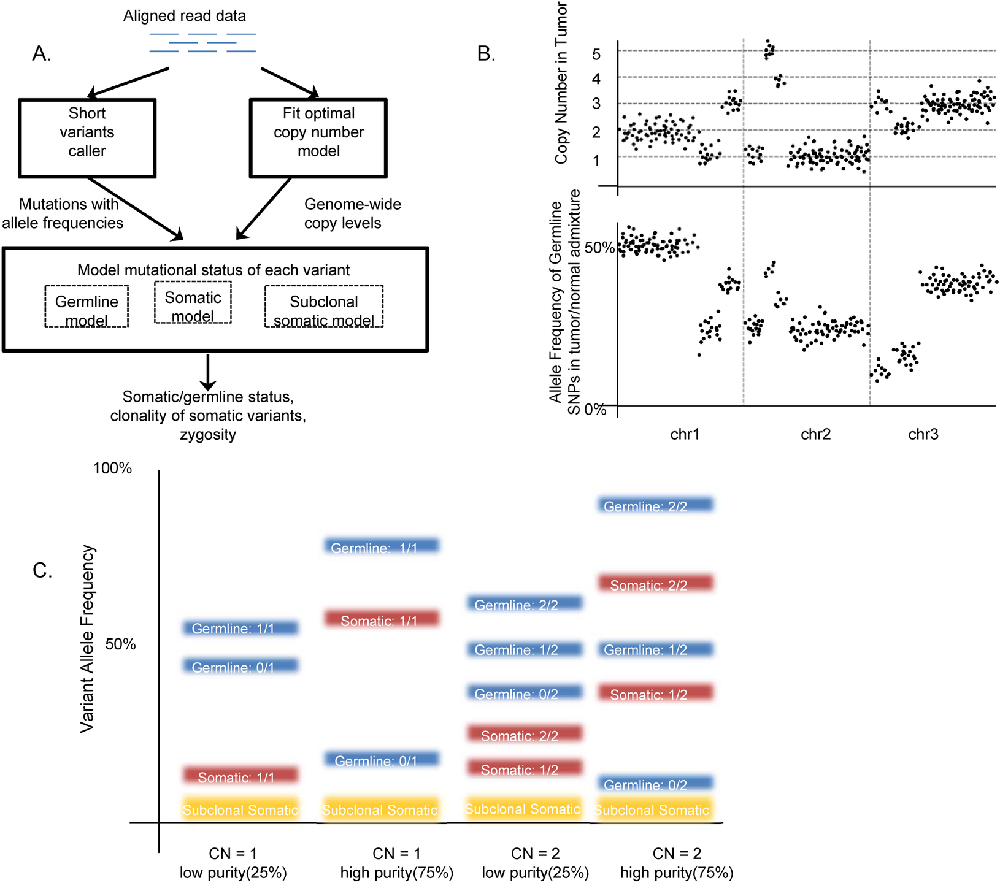
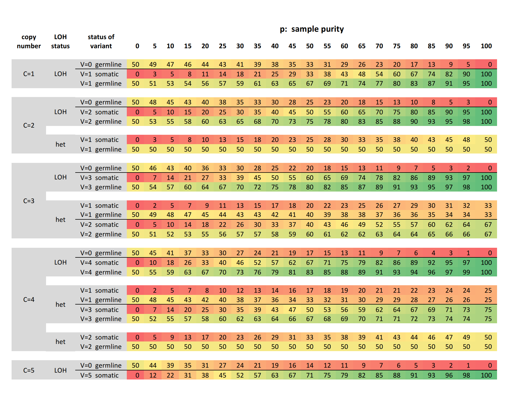

## NGS process

* Library preparation  
  - DNA pool (diversity, many cells)
  - Targeted (multiplexing PCR, Hybrid capture)  
  - Adeptor ligation (ID, primer, platform adaptor)  

* Sequencing    
  - Amplification (to enhance signal)
  - Sequencing (capture photo, check electric current change)
  
* Alignment  
  - SAM, BAM file  
  
* Variant calling  
  - Bayes approach 
  
  $$\text{Posterior} = (\text{Prior} * \text{Likelyhood} )/\text{Normalizing constant}$$  

## Allele frequency (AF)  

* Allele  
  - Population  
  - Cancer  

* Somatic vs Germline  
  - CNV  
  - Minor allele frequency  
  - Tumor cellularity 

* CNV  
  - CNV  
  - Minor allele frequency  
  - Tumor cellularity 

* Markov Chain Monte Carlo (MCMC)  
  - Hierachical model  
  - Determine parameter distribution by simulation  

  
