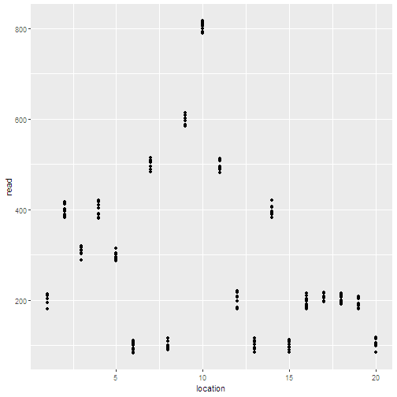
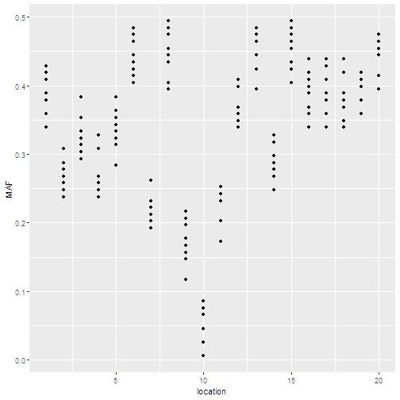
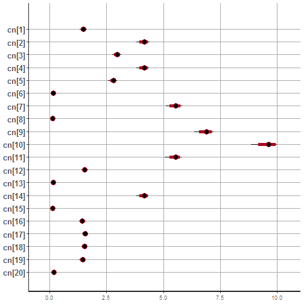
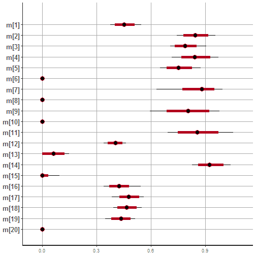
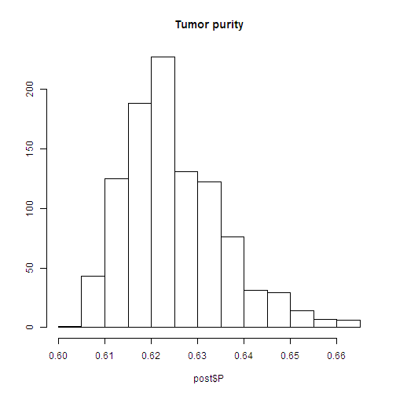
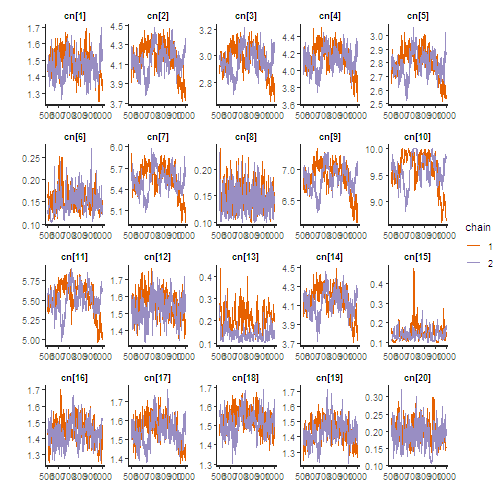

Bayesian
========================================================
author: Jun Kang
date: September 4, 2019
autosize: true
css: custom.css
<style>
.reveal .slides section .slideContent{
    font-size: 24pt;
}
</style>

Coin toss
=======================================================

- Observed data (H, H, H, H, H, H, H, H, H, H) <br>
- Guess the probability of coming head: 0.5? or 1.0?

Frequentist approch (What usually has been done)
======================================================
- Null hypothesis: probability of coming head is 0.5
- Hypothesis testing: Probability of observed data under null hypothesis a.k.a. p-value = ($\frac{1}{2}^{10}$)
- Hypothesis rejection: probability of coming head is not 0.5

Coin toss prior probability
=======================================================

- The gambling dealer!! <br>
- Guess the probability of coming head after seeing 10 continuous head: 0.5? or 1.0?


Coin toss prior probability
=======================================================

- Stanford reseach gives the probability 0.51!!
- Guess the probability of coming head after seeing 10 continuous head: 0.5? 0.51? 0.6? 0.7? 1.0?

Bayes theorem 1
======================================================

$$
\begin{equation}
\label{eq:bayes}
P(\theta|\textbf{D}) = P(\theta ) \frac{P(\textbf{D} |\theta)}{P(\textbf{D})} \end{equation}
$$

Bayes theorem 2
================================================
$$
\text{Posterior} = (\text{Prior} * \text{Likelyhood} )/\text{Normalizing constant}
$$

- Posterior
- Prior
- Likelyhood
- Normalizing constant

=================================================
Likelyhood function
<br>
<br>
$$\mathcal{L}(\theta \mid x) = p_\theta (x) = P_\theta (X=x)
$$
<br>

$$
\mathcal{L}(p_\text{H}=0.5 \mid \text{HH}) = 0.25.
$$

$$
\mathcal{L}(p_\text{H}=1.0 \mid \text{HH}) = 1.0.
$$

***

Probability distribution function
<br>
<br>
$$
\sum_u \operatorname{P}(X=u) = 1
$$

$$
P(\text{H} \mid p_\text{H}=0.5) = 0.5.
$$

$$
P(\text{T} \mid p_\text{H}=0.5) = 0.5.
$$

Bayesian example in genotype (SOAPsnp)
===================================================

Genotype calling
====================================================

Genome Res. 2009. 19: 1124-1132

Likelyhood of genotype calling
====================================================
- Allele type
- Quality score
- Coordinates on the read
- t-th occurrence 

A:0, T:3, G:0, C:0, <br>
phred score: 30, 30, 30 <br>
Likelyhood?

Likelyhood of genotype calling
====================================================
$$
\text{L(Genotype T/G)|Read(T,T,T))} = (0.5*(1-0.001) + 0.5*0.001)^3
$$

$$
\text{L(Genotype T/T)|Read(T,T,T))} = (1-0.001)^3
$$

$$
\text{.}
$$
$$
\text{.}
$$
$$
\text{.}
$$

Prior probability 
====================================================

- Reference allele: G
- Homozygous SNP rate: 0.0005
- Heterozygous SNP rate: 0.001
- Ratio of transitions versus transversions: 4

Posterior probability (incomplete)
==================================================
<br><br>

$$
\text{Posterior (Genotype T/G|Read(T,T,T))} 
$$

$$
= Prior (1.67*10^{-4}) * Likelyhood (0.5*(1-0.001) + 0.5*0.001)^3
$$

$$
=2.09*10^{-5}
$$

<br> <br> <br>

$$
\text{Posterior (Genotype T/T|Read(T,T,T))}
$$

$$ 
= Prior (8.33*10^{-5}) * Likelyhood((1-0.001)^3)
$$

$$
=8.31*10^{-5}
$$

Normalizing constant
====================================================
$$
P(D)=\sum_i P(D|H_i)P(H_i) \
$$

- Markov chain Monte Carlo (MCMC)
- WinBUGS
- JAGS
- STAN

MCMC
===================================================
<blockquote class="imgur-embed-pub" lang="en" data-id="2p1va60"><a href="//imgur.com/2p1va60"></a></blockquote><script async src="//s.imgur.com/min/embed.js" charset="utf-8"></script>
```
MCMC (Gibbs sampling)
===================================================
<blockquote class="imgur-embed-pub" lang="en" data-id="91TeFpu"><a href="//imgur.com/91TeFpu"></a></blockquote><script async src="//s.imgur.com/min/embed.js" charset="utf-8"></script>

Three steps of Bayesian data analysis  
=====================================================


- Full probability model
- Conditioning on obsereved data (posterior distribution)
- Evaluating the fit of the model and the implications of the resulting posterior distribution

Bayesian Data Analysis 3rd, Andrew Gelman et. al.

Copy number and tumor purity estimation
========================================================

A computational approach to distinguish somatic vs. germline origin of genomic alterations from deep sequencing of cancer specimens without a matched normal <https://journals.plos.org/ploscompbiol/article?id=10.1371/journal.pcbi.1005965>.

SGZ method overview
============================================


Allele frequency table
============================================


Full probability model
============================================


$$
\begin{aligned}
 r_i & \sim & N\left(log_2 \frac{pC_i+2(1-p)}{p \psi+2(1-p)}, \sigma_{ri} \right)
\end{aligned}
$$

$$
\begin{aligned}
 f_i & \sim & N\left(\frac{pM_i+(1-p)}{pC_i+2(1-p)}, \sigma_{fi} \right)
\end{aligned}
$$

$$
\psi = \frac{\sum_{i}(l_iC_i) }{\sum_{i}(l_i)} \
$$
 
\(\\r_i\\): Median-normalized log-ratio coverage of all exons within \(\\S_i\\) <br>
\(\\f_i\\): MAF of SNPs within segment \(\\S_i\\) <br>
\(\\p\\): Tumor purity <br>
\(\\S_i\\): Genomic segment <br>
\(\\l_i\\): Length of \(\\S_i\\) <br>
\(\\C_i\\): Copy number of \(\\S_i\\) <br>
\(\\M_i\\): Copy number of minor alleles in \(\\S_i\\), \(\\0 \leq M_i \leq S_i\\) <br>
\(\psi\): Tumor ploidy of the sample


Toy data (read distribution)
======================================================


Toy data (MAF distribution)
======================================================



Stan code (continued)
=======================================================

```r
'data {
  int N;
  real r[N];
  real f[N];
  int<lower=1> Nsub;
  int<lower=1> s[N];
}'
```


Stan code (continued)
=======================================================

```r
'parameters {
  real<lower=0.1, upper=10> cn[Nsub];
  real m_logit[Nsub];
  vector<lower=0>[Nsub] sigma_cn;
  vector<lower=0>[Nsub] sigma_m;
  real<lower=0, upper=1.0> P;
}
transformed parameters {
  real m[Nsub];
  real psi;
  for (i in 1:Nsub){
    m[i] = (0+(cn[i]/2-0)*inv_logit(m_logit[i])); //log jacobian determinant stan constraints transformation
  }
  psi = mean(cn);
}'
```

Stan code (last)
====================================================

```r
'model {
  for(i in 1:N){
  r[i] ~ normal(log2((P*cn[s[i]] + 2*(1-P))/(P*psi + 2*(1-P))),sigma_cn[s[i]]);
  f[i] ~ normal((P*m[s[i]]+1-P)/(P*cn[s[i]]+2*(1-P)), sigma_m[s[i]]);
  }
}'
```

Fit
=======================================================

```r
set.seed(456278)
fit <- stan(model_code = code, data = mydata, iter = 1000, 
            chains = 2, control = list(adapt_delta = 0.9,
                                       max_treedepth = 5))
```

```

SAMPLING FOR MODEL 'bbf094d9726824acefd8182f735092aa' NOW (CHAIN 1).
Chain 1: 
Chain 1: Gradient evaluation took 0 seconds
Chain 1: 1000 transitions using 10 leapfrog steps per transition would take 0 seconds.
Chain 1: Adjust your expectations accordingly!
Chain 1: 
Chain 1: 
Chain 1: Iteration:   1 / 1000 [  0%]  (Warmup)
Chain 1: Iteration: 100 / 1000 [ 10%]  (Warmup)
Chain 1: Iteration: 200 / 1000 [ 20%]  (Warmup)
Chain 1: Iteration: 300 / 1000 [ 30%]  (Warmup)
Chain 1: Iteration: 400 / 1000 [ 40%]  (Warmup)
Chain 1: Iteration: 500 / 1000 [ 50%]  (Warmup)
Chain 1: Iteration: 501 / 1000 [ 50%]  (Sampling)
Chain 1: Iteration: 600 / 1000 [ 60%]  (Sampling)
Chain 1: Iteration: 700 / 1000 [ 70%]  (Sampling)
Chain 1: Iteration: 800 / 1000 [ 80%]  (Sampling)
Chain 1: Iteration: 900 / 1000 [ 90%]  (Sampling)
Chain 1: Iteration: 1000 / 1000 [100%]  (Sampling)
Chain 1: 
Chain 1:  Elapsed Time: 1.253 seconds (Warm-up)
Chain 1:                1.252 seconds (Sampling)
Chain 1:                2.505 seconds (Total)
Chain 1: 

SAMPLING FOR MODEL 'bbf094d9726824acefd8182f735092aa' NOW (CHAIN 2).
Chain 2: 
Chain 2: Gradient evaluation took 0 seconds
Chain 2: 1000 transitions using 10 leapfrog steps per transition would take 0 seconds.
Chain 2: Adjust your expectations accordingly!
Chain 2: 
Chain 2: 
Chain 2: Iteration:   1 / 1000 [  0%]  (Warmup)
Chain 2: Iteration: 100 / 1000 [ 10%]  (Warmup)
Chain 2: Iteration: 200 / 1000 [ 20%]  (Warmup)
Chain 2: Iteration: 300 / 1000 [ 30%]  (Warmup)
Chain 2: Iteration: 400 / 1000 [ 40%]  (Warmup)
Chain 2: Iteration: 500 / 1000 [ 50%]  (Warmup)
Chain 2: Iteration: 501 / 1000 [ 50%]  (Sampling)
Chain 2: Iteration: 600 / 1000 [ 60%]  (Sampling)
Chain 2: Iteration: 700 / 1000 [ 70%]  (Sampling)
Chain 2: Iteration: 800 / 1000 [ 80%]  (Sampling)
Chain 2: Iteration: 900 / 1000 [ 90%]  (Sampling)
Chain 2: Iteration: 1000 / 1000 [100%]  (Sampling)
Chain 2: 
Chain 2:  Elapsed Time: 1.23 seconds (Warm-up)
Chain 2:                1.247 seconds (Sampling)
Chain 2:                2.477 seconds (Total)
Chain 2: 
```

Posterior of copy number
========================================================

```r
plot(fit, pars = 'cn')
```



Posterior of minor allele copy number
========================================================

```r
plot(fit, pars = 'm')
```



Posterior of tumor purity
========================================================

```r
post <- extract(fit)

hist(post$P,
     main = paste("Tumor purity"),
     ylab = '')
```



Trace Plot
========================================================

```r
traceplot(fit, pars = 'cn')
```



Diagnostic Plot
========================================================

```r
stan_diag(fit)
```


