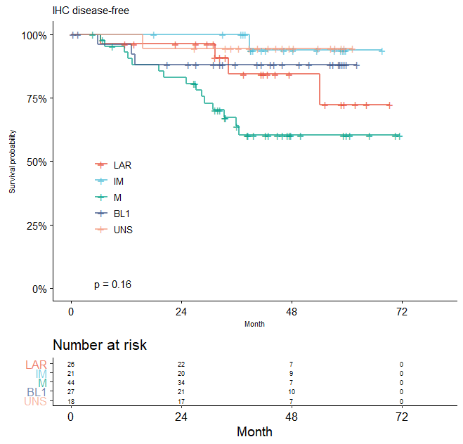
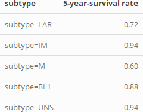
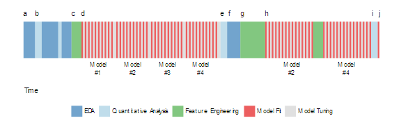
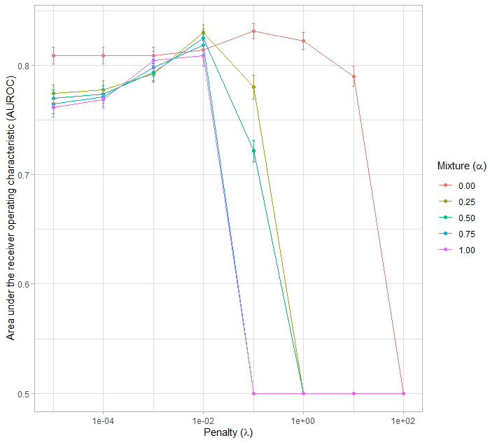
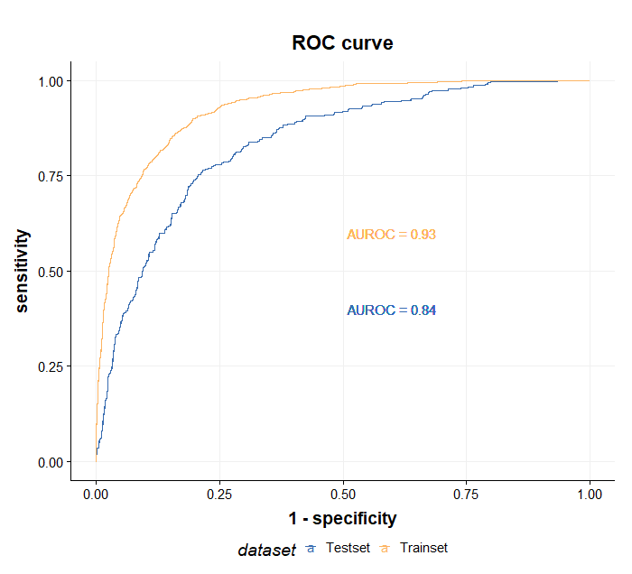

```{r setup, include=FALSE}
knitr::opts_chunk$set(
	echo = FALSE,
	message = FALSE,
	warning = FALSE
)
options(htmltools.dir.version = FALSE)
```

```{r xaringan-themer, include=FALSE, warning=FALSE}
library(xaringanthemer)
style_mono_accent(
  base_color = "#1c5253",
  header_font_google = google_font("Josefin Sans"),
  text_font_google   = google_font("Montserrat", "300", "300i"),
  code_font_google   = google_font("Fira Mono"),
  base_font_size = "20px",
  text_font_size = "1.6rem"
  )

```

```{r cache=FALSE, include=FALSE, load_refs, include=FALSE}
library(RefManageR)
BibOptions(check.entries = FALSE,
           bib.style = "numeric",
           cite.style = "numeric",
           style = "markdown",
           hyperlink = FALSE,
           dashed = FALSE)
myBib <- ReadBib("references.bib", check = FALSE)
```

# Contents

- Hypothesis test vs Prediction
- Predictive Model vs Predictive modeling
- Over fitting
  - Hyper-parameter tuning
  - Cross-validation
  - Training set vs validation set vs test set
  
---
# Hypothesis test

---
# Hypothesis test

- Inference
- Statistical power
- Compatibility of data for hypothesis
- Assumptions of statistical model

---
# Prediction




---
# Prediction

- Building a model
- Performance
- Over-fitting

---
# Modeling process


.footnote[
image from https://github.com/topepo/rstudio-conf-2019/blob/master/Materials/images/intro-process-1.svg
]
---
# Prediction of PIK3CA Mutations from Cancer Gene Expression Data

- PLOS ONE, (15), 11, pp. e0241514,

---
# Purpose

- Predict PIK3CA mutations from gene expression data
- Supervised elastic net penalized logistic regression model

---
# Dataset
- TCGA pan-cancer dataset
- Training set (3/4) test set (1/4)

---
# Preprocessing

- Yeo-Johnson transformation
- Centering
- Scaling 

---
# Hyperparameter tuning

- 10-fold cross-validation
- Hyper-parameter grid
  - Penalty $\lambda$: $10^{-5}$, $10^{-4}$, $10^{-3}$, $10^{-2}$, $10^{-1}$, $10^{0}$
  - Mixing $\alpha$: $0.0$, $0.25$, $0.5$, $0.75$, $1.0$

---
# Cross-validation


.footnote[
image from https://github.com/topepo/rstudio-conf-2019/blob/master/Materials/images/cross-validation.png
]
---
# Hyperparameter tuning



---
# Performance



---
# References

- Applied Predictive Modeling, 2013, Max Kuhn, Kjell Johnson, Springer
- Feature Engineering and Selection: A Practical Approach for Predictive Models, 2019, Max Kuhn, Kjell Johnson, Chapman and Hall/CRC
- Applied Machine Learning" at Rstudio::conf 2019 (January 15 & 16, Austin, Texas
- Kang J, Lee A, Lee YS (2020) Prediction of PIK3CA mutations from cancer gene expression data. PLoS ONE 15(11): e0241514. 