# Annotation redundancy  

+ Exact variants (indication for targeted therapy)  
+ **Many annotations** for a **same variant**  

# Case 1

5.3cm, central mass in LUL, obstructing LUL bronchus Suspicious invasion of left upper pulmonary artery

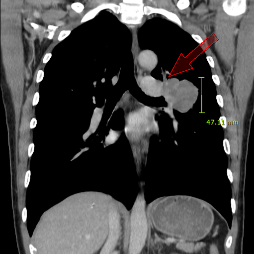{height=400px} 

--- 

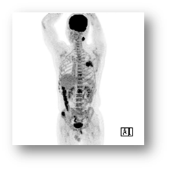{height=400px}

---

#  Pathology 

+ Lymph node, level II, left, needle biopsy;
+ **Adenocarcinoma, solid type** **,** **metastatic**
+ PD-L1: 22C3(0%), SP142(0%)

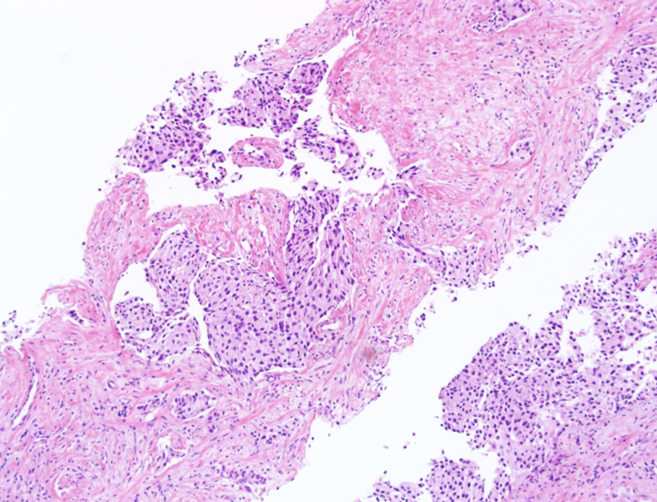{height=400px}

---

# TTF-1
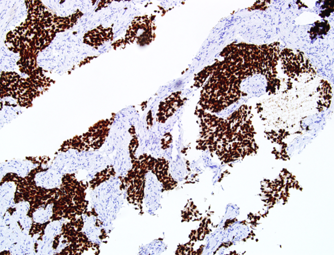{height=400px}

---

#  Molecular 

+ **EGFR** **PNAClamp** : negative
+ **FISH** : ALK(-), ROS1(-), RET(-)

---

#  NGS (Ion Torrent)

+ ERBB2 exon20 insertion  
+ Afatinib: irreversible EGFR TKI

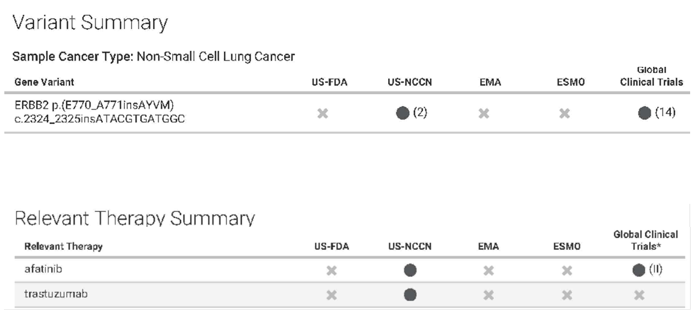

---

# Ion Reporter, COSMIC, VEP (Variant Effect Predictor, Ensembl) [-@__what_]

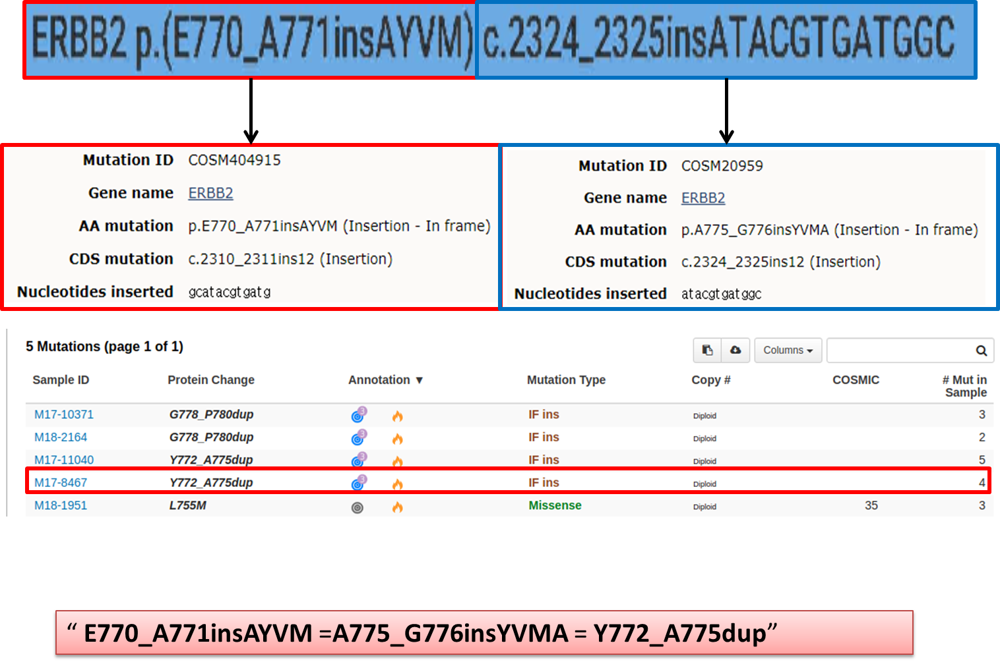

---

# Redundant annotations for ERBB2 insertion mutation 

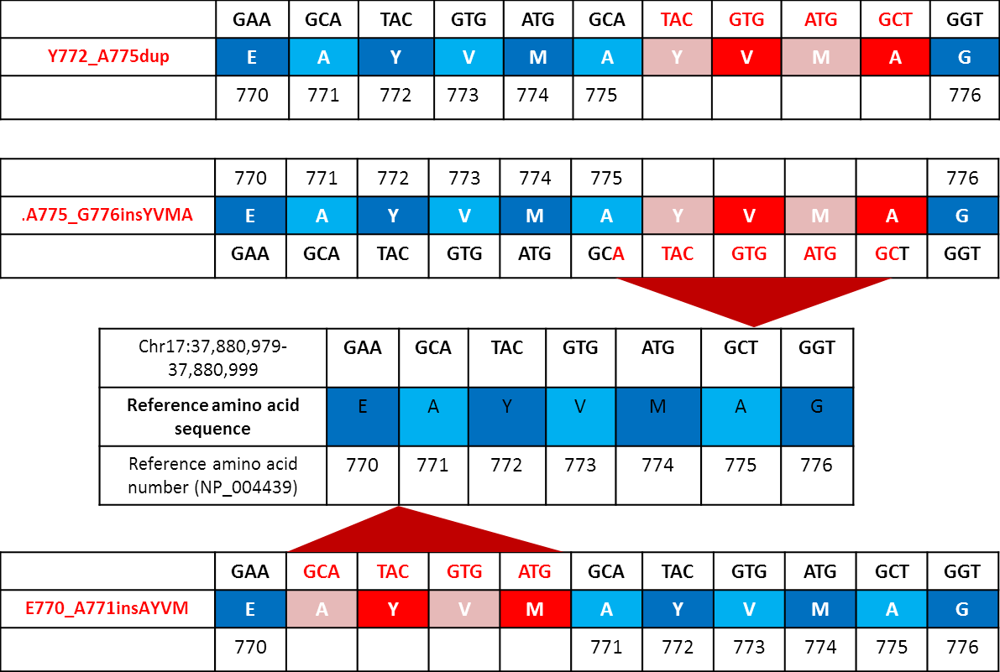{height=200px}

---

# Redundant annotations for ERBB2 insertion mutation 


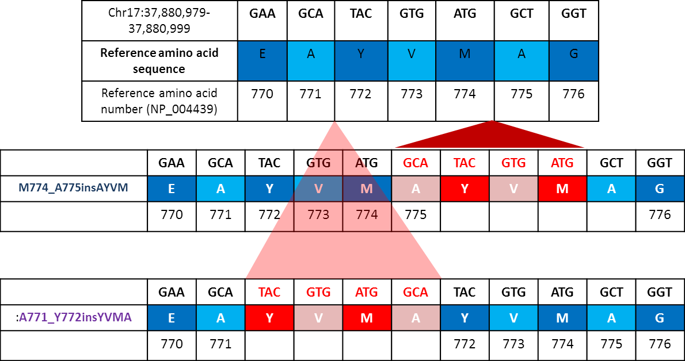

---

# Nature volume 554, pages 189–194 (08 February 2018) [-@hyman_2018_her_nature]  

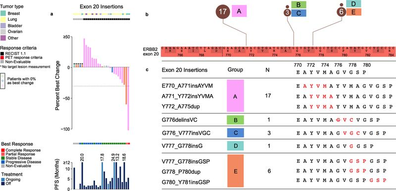

---

# Nat Med. 2018 May;24(5):638-646 [-@robichaux_2018_mechanisms_natmed]  

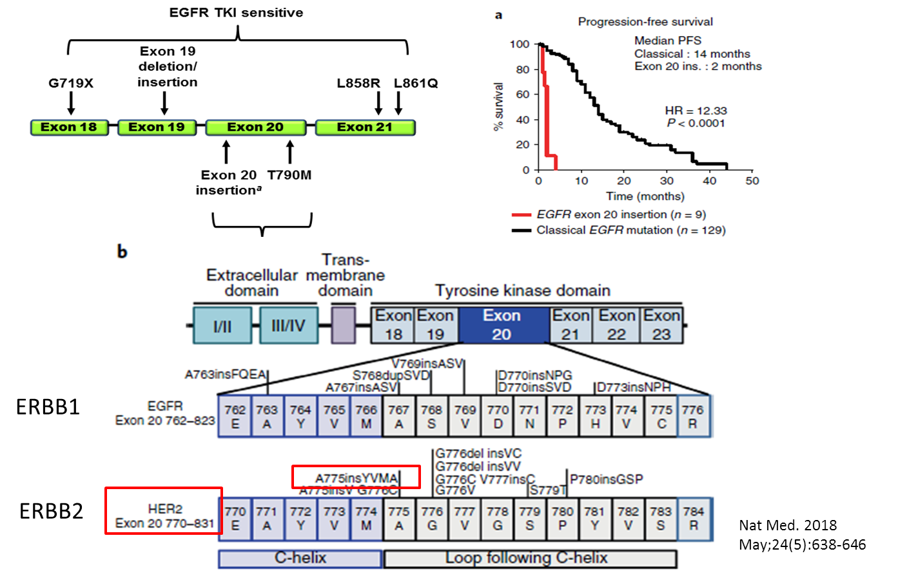{height=200px}

---

# Case 2

+ F/80
+ Adenocarcinoma of lung

---

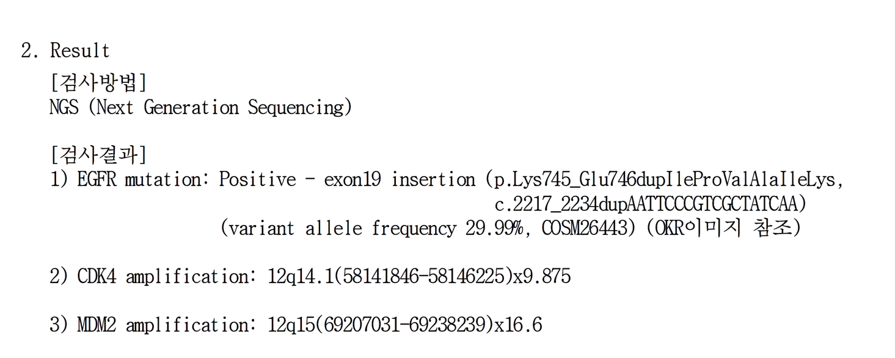

---

# EGFR Exon 19 insertion

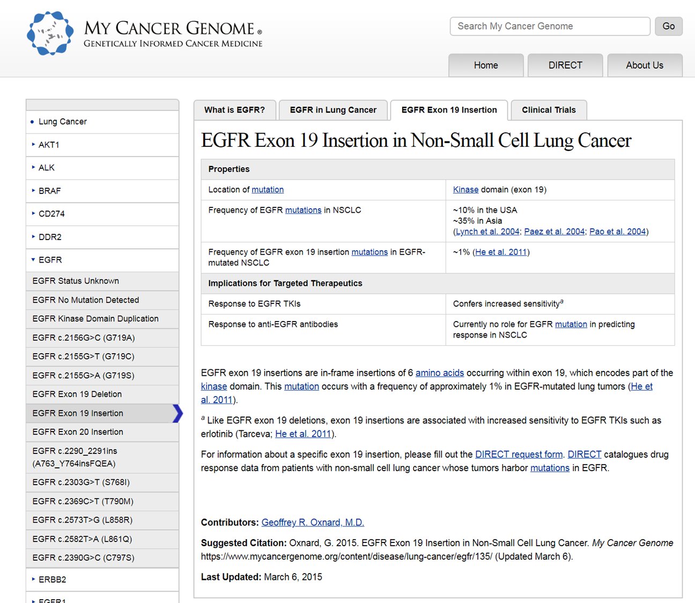{height=700px}

---

#  Annotation Redundancy EGFR exon 19 insertion 


```{r tbl13, echo = FALSE}
tbl13 <- tibble::tribble(
~` `, ~`CDS mutation`, ~`AA mutation`,
"Ion Reporter (IR)","c.2234_2235ins","p.V738_K739insKIPVAI",
"Cosmic","c.2232_2233ins","p.K745_E746insIPVAIK",
"Pathology  Report","c.2217_2234dup","p.K745_E750dupIPVAIK",
"Clinical Cancer Reserch","c.2217_2234dup","p.K745_E746insIPVAIK"
)

kableExtra::kable_styling(knitr::kable(tbl13), full_width = TRUE, font_size = 8)
```

---

# Allignment  

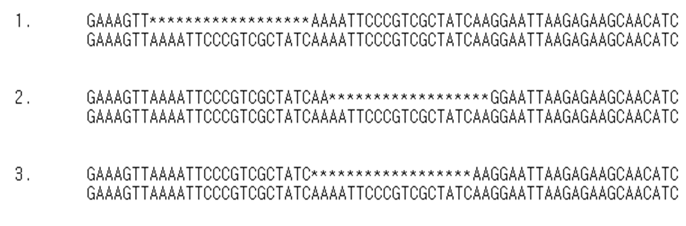  

---

# Clin Cancer Res; 18(6); 1790–7 [-@he_2012_egfr_clinicalcancerresearch]  

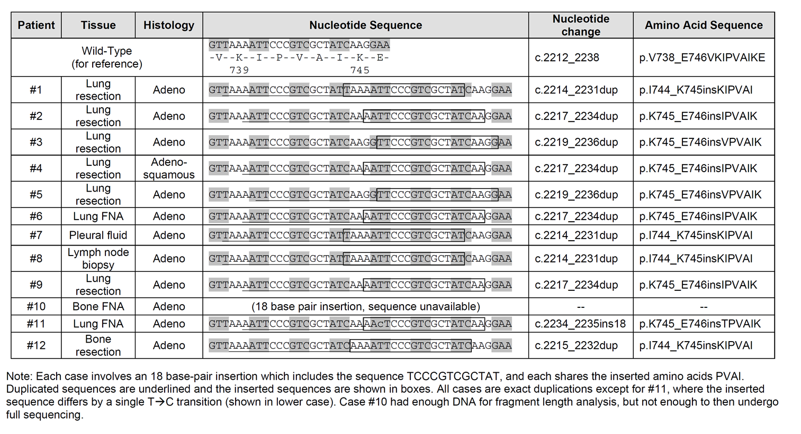  

---

# Mutation Nomenclature [-@dunnen_2000_mutation_hummutat] 

> No recommendations have been made to describe
duplications. Although they can be seen as a specific
type of insertion, and could be described as such,
they often originate through other mutational mechanisms.
We therefore prefer to provide a distinctive
designation of this type of sequence change

---
# Variant Normalization  

https://genome.sph.umich.edu/wiki/Variant_Normalization

---
# HGVS vs VEP

* HGVS Recommendations for the Description of Sequence  
* Variants: 2016 Update  

The Ensembl Variant Effect Predictor
---
# HGVS Recommendations for the Description of Sequence Variants: 2016 Update    

http://varnomen.hgvs.org/recommendations/
---

# Conclusions  

* Redundant annotation  
  + ERBB2 exon20, EGFR exon19 insertion/duplication  
  
# References {.allowframebreaks} 
  