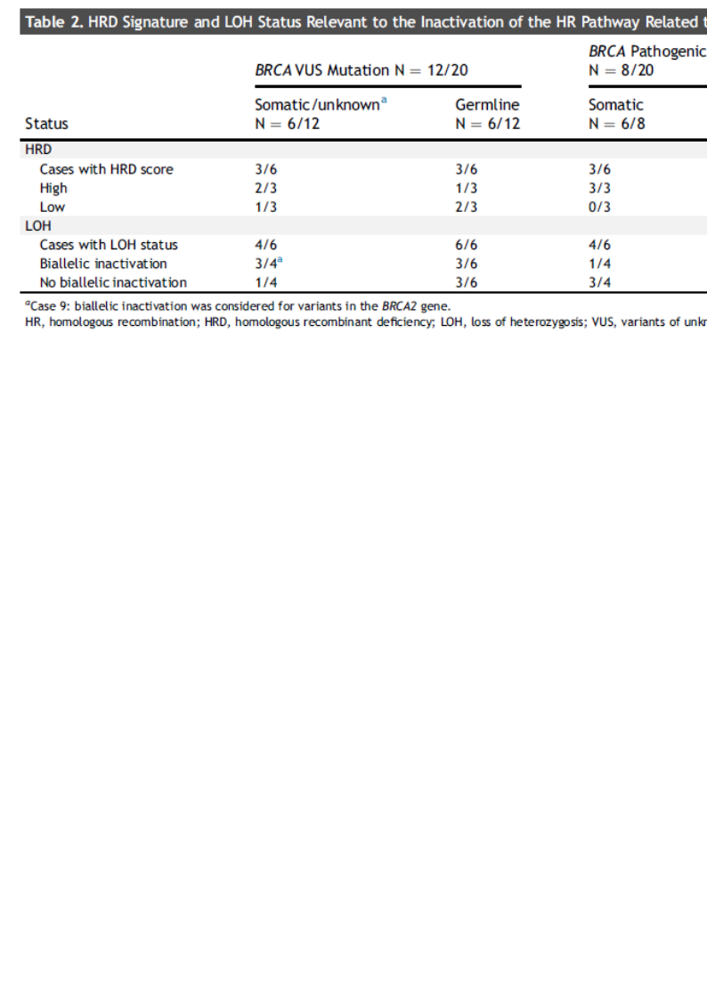

```{r setup, include=FALSE}
options(htmltools.dir.version = FALSE)
knitr::opts_chunk$set(
  fig.width=9, fig.height=3.5, fig.retina=3,
  out.width = "100%",
  cache = TRUE,
  echo = FALSE,
  message = FALSE, 
  warning = FALSE,
  fig.show = TRUE,
  hiline = TRUE
)
```

```{r xaringan-themer, include=FALSE, warning=FALSE}
library(xaringanthemer)
style_duo_accent(
  primary_color = "#1381B0",
  secondary_color = "#FF961C",
  inverse_header_color = "#FFFFFF",
  text_font_size = "1.5rem"
)
```

```{r cache=FALSE, include=FALSE, load_refs, include=FALSE}
library(RefManageR)
library(citr)
BibOptions(check.entries = FALSE,
           bib.style = "numeric",
           cite.style = "numeric",
           hyperlink = FALSE,
           dashed = FALSE,
           first.inits = TRUE,
           no.print.fields = c("doi", "url", "isbn", "urldate"))
myBib <- ReadBib("references.bib", check = FALSE)
```
class: center

# BRCA mutation from cbioportal

```{r}
library(tidyverse)
dataBRCA <- read_tsv(here::here("static/slide/BRCApancancer/data/tableCbioportalBRCA.tsv"))

data_small <- dataBRCA %>%
  select(1:12)

library(skimr)

dataAll <- read_tsv(here::here("static/slide/BRCApancancer/data/alterations_across_samples.tsv"))

dataJoin <- data_small %>%
  full_join(dataAll)

data <- dataJoin %>%
  arrange(`Study ID`, `Cancer Type`) %>%
  fill(`Study of Origin`, `Cancer Type`, `Cancer Type Detailed...4`) %>%
  filter(!is.na(`Cancer Type`)) %>%
  mutate(`Cancer Type` = fct_lump(`Cancer Type`, n = 30)) %>%
  mutate(`Mutation Type` = fct_explicit_na(`Mutation Type`, "Wild type")) %>%
  mutate(MutationType = fct_collapse(`Mutation Type`,
                                     "Frame shift" = c("Frame_Shift_Del", "Frame_Shift_Ins"),
                                     "Splice" = c("Splice_Region", "Splice_Site", "Translation_Start_Site")))


```

```{r}
data %>%
  group_by(`Cancer Type`) %>%
  summarize(prop = sum(Altered)/n()) %>%
  mutate(`Cancer Type` = fct_reorder(`Cancer Type`, prop)) %>%
  ggplot(aes(x=`Cancer Type`, y=prop)) +
  geom_bar(stat = "identity") +
  ylab("Proportion") +
  xlab("") +
  coord_flip()
```

---
# Mutation type

```{r}
data %>%
  count(MutationType) %>%
  mutate(MutationType = fct_reorder(MutationType, n)) %>%
  knitr::kable()

```


---
class: center

# Frame shift
```{r}
data %>%
  group_by(`Cancer Type`) %>%
  summarize(prop = sum(MutationType=="Frame shift")/n()) %>%
  mutate(`Cancer Type` = fct_reorder(`Cancer Type`, prop)) %>%
  ggplot(aes(x=`Cancer Type`, y=prop)) +
  geom_bar(stat = "identity") +
  ylab("Proportion") +
  xlab("") +
  coord_flip()

```

---

class: center

# Nonsense
```{r}
data %>%
  group_by(`Cancer Type`) %>%
  summarize(prop = sum(MutationType=="Nonsense_Mutation")/n()) %>%
  mutate(`Cancer Type` = fct_reorder(`Cancer Type`, prop)) %>%
  ggplot(aes(x=`Cancer Type`, y=prop)) +
  geom_bar(stat = "identity") +
  ylab("Proportion") +
  xlab("") +
  coord_flip()

```

---

class: center

# Splice
```{r}
data %>%
  group_by(`Cancer Type`) %>%
  summarize(prop = sum(MutationType=="Splice")/n()) %>%
  mutate(`Cancer Type` = fct_reorder(`Cancer Type`, prop)) %>%
  ggplot(aes(x=`Cancer Type`, y=prop)) +
  geom_bar(stat = "identity") +
  ylab("Proportion") +
  xlab("") +
  coord_flip()

```

---

class: center

# Missense
```{r}
data %>%
  group_by(`Cancer Type`) %>%
  summarize(prop = sum(MutationType=="Missense_Mutation")/n()) %>%
  mutate(`Cancer Type` = fct_reorder(`Cancer Type`, prop)) %>%
  ggplot(aes(x=`Cancer Type`, y=prop)) +
  geom_bar(stat = "identity") +
  ylab("Proportion") +
  xlab("") +
  coord_flip()
```

---
# BRCA HRD and LOH in non-small cell carinoma `r Citep(myBib, "remonSomaticGermlineBRCA2020")`

---
# References

```{r refs, echo=FALSE, results="asis"}
PrintBibliography(myBib)
```