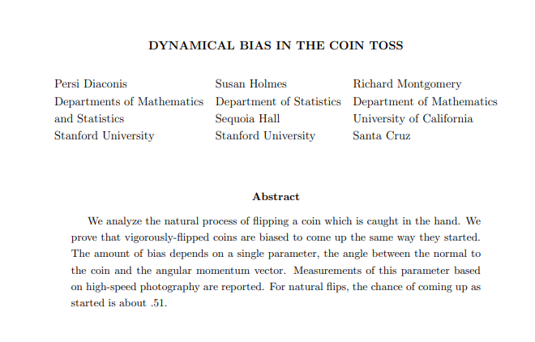

```{r setup, include=FALSE}
options(htmltools.dir.version = FALSE)
knitr::opts_chunk$set(
  fig.width=9, fig.height=3.5, fig.retina=3,
  out.width = "100%",
  cache = FALSE,
  echo = TRUE,
  message = FALSE, 
  warning = FALSE,
  fig.show = TRUE,
  hiline = TRUE
)
knitr::opts_knit$set(upload.fun = knitr::imgur_upload)
```

```{r xaringan-themer, include=FALSE, warning=FALSE}
library(xaringanthemer)
style_duo_accent(
  primary_color = "#1381B0",
  secondary_color = "#FF961C",
  inverse_header_color = "#FFFFFF",
  text_font_size = "1.5rem"
)
```

# Contents
- Genotyping
- Copy number and tumor purity estimation

---
class: center

# Coin toss

Observed data (H, H, H, H, H, H, H, H, H, H)   

Guess the probability of coming head:  
0.5? or 1.0?

---
# Frequentist approch (What usually has been done)

- Null hypothesis: probability of coming head is 0.5
- Hypothesis testing: Probability of observed data under null hypothesis a.k.a. p-value = ( $\frac{1}{2}^{10}$ )
- Hypothesis rejection: probability of coming head is not 0.5

---

class: center

# Coin toss prior probability
.pull-left[

]
  

The gambling dealer!!  

Guess the probability of coming head after seeing 10 continuous head:  
0.5? or 1.0?

---
clss: center

# Coin toss prior probability

.pull-left[

]

Stanford reseach gives the probability 0.51!!  

Guess the probability of coming head after seeing 10 continuous head:  
0.5? 0.51? 0.511? 0.510001?

---
class: center

# Bayes theorem 1

$$P(\theta|\textbf{D}) = P(\theta ) \frac{P(\textbf{D}|\theta)}{P(\textbf{D})}$$

---
class: center

# Bayes theorem 2

$$\text{Posterior} = (\text{Prior} * \text{Likelyhood} )/\text{Normalizing constant}$$

Posterior  
Prior  
Likelyhood  
Normalizing constant

---
class: center

# Likelyhood function

$$\mathcal{L}(\theta \mid x) = p_\theta (x) = P_\theta (X=x)$$
$$\mathcal{L}(p_\text{H}=0.5 \mid \text{HH}) = 0.25$$

$$\mathcal{L}(p_\text{H}=1.0 \mid \text{HH}) = 1.0$$

---
class: center

# Probability distribution function

<br>
<br>
$$
\sum_u \operatorname{P}(X=u) = 1
$$

$$
P(\text{H} \mid p_\text{H}=0.5) = 0.5.
$$

$$
P(\text{T} \mid p_\text{H}=0.5) = 0.5.
$$

---
# Bayesian example in genotype (SOAPsnp)

.center[

]
Genome Res. 2009. 19: 1124-1132

---
# Likelyhood of genotype calling

- Allele type
- Quality score
- Coordinates on the read
- t-th occurrence 

A:0, T:3, G:0, C:0  
phred score: 30, 30, 30  
Likelyhood?

---
class: center

# Likelyhood of genotype calling

  
$$
\text{L(Genotype T/G)|Read(T,T,T))} = (0.5 \times (1-0.001)+0.5 \times0.001)^3
$$ 
$$
 = 0.125
$$
$$
\text{L(Genotype T/T)|Read(T,T,T))} = (1-0.001)^3 = 0.997
$$

$$
\text{L(Genotype G/G)|Read(T,T,T))} = 0.001^3 = 10^{-9}
$$

$$
\text{.}
$$
$$
\text{.}
$$
$$
\text{.}
$$

---
class: center
# Prior probability 


Reference allele: G  
Homozygous SNP rate: 0.0005  
Heterozygous SNP rate: 0.001  
Ratio of transitions versus transversions: 4  

---
class: center
# Posterior probability

$$
\text{Posterior (Genotype T/G|Read(T,T,T))}
$$

$$= Prior (1.67*10^{-4}) \times Likelyhood (0.5*(1-0.001) + 0.5*0.001)^3$$
$$
=2.09*10^{-5}
$$

---
class: center
# Posterior probability

$$
\text{Posterior (Genotype T/T|Read(T,T,T))}
$$

$$= Prior (8.33*10^{-5}) \times Likelyhood((1-0.001)^3)$$

$$
=8.31*10^{-5}
$$
---
class: center
# Posterior probability

$$
\text{Posterior (Genotype G/G|Read(T,T,T))}
$$

$$= Prior (0.9985) \times Likelyhood(10^{-9})$$

$$
=10^{-9}
$$

---
# Thermor Fisher 

- Flow evaluator
  - Base calling re-evaluation after read mapping
- Allele specific copy number estimation
  - LOH
  - HRD

---
# Normalizing constant

$$
P(D)=\sum_i P(D|H_i)P(H_i) \
$$

- Markov chain Monte Carlo (MCMC)
- WinBUGS
- JAGS
- STAN

---
class: center
# MCMC


---
# Three steps of Bayesian data analysis  

```{r, message=FALSE, warning=FALSE, include=FALSE, echo=FALSE}
library(knitr)
read_chunk(here::here("static/slide/Bayes_Xaringan/Bayes_and_NGS.R"))
```

- Full probability model
- Conditioning on obsereved data (posterior distribution)
- Evaluating the fit of the model and the implications of the resulting posterior distribution

Bayesian Data Analysis 3rd, Andrew Gelman et. al.

---
# Copy number and tumor purity estimation

A computational approach to distinguish somatic vs. germline origin of genomic alterations from deep sequencing of cancer specimens without a matched normal <https://journals.plos.org/ploscompbiol/article?id=10.1371/journal.pcbi.1005965>.

---
class: center

# Somatic-germline-zygosity method overview
  


---
class: center
# Allele frequency table
  


---
class: center

# Full probability model

```{r, echo=FALSE}
<<library>>
```

.pull-left[
$$
\begin{aligned}
 r_i & \sim N\left(log_2 \frac{pC_i+2(1-p)}{p \psi+2(1-p)}, \sigma_{ri} \right)
\end{aligned}
$$

$$
\begin{aligned}
 f_i & \sim N\left(\frac{pM_i+(1-p)}{pC_i+2(1-p)}, \sigma_{fi} \right)
\end{aligned}
$$

$$\psi = \frac{\sum_{i}(l_iC_i) }{\sum_{i}(l_i)}$$
]

.pull-right[
$r_i$: Median-normalized log-ratio coverage of all exons within $S_i$  
$f_i$: MAF of SNPs within segment $S_i$  
$p$: Tumor purity <br>
$S_i$: Genomic segment <br>
$l_i$: Length of $S_i$ <br>
$C_i$: Copy number of $S_i$ <br>
$M_i$: Copy number of minor alleles in $S_i$, $0 \leq M_i \leq S_i$ <br>
$\psi$: Tumor ploidy of the sample
]

```{r, echo=FALSE, cache=TRUE}
<<data_gen>>
```
```{r, echo=FALSE}
<<code>>
```

---
# Toy data (read distribution)

```{r, echo=FALSE}
<<read_distribution>>
```

---
# Toy data (MAF distribution)

```{r, echo=FALSE}
<<MAF_distribution>>
```

---
#Stan code (continued)

```{r, eval=FALSE}
<<code1>>
```

---
# Stan code (continued)

```{r, eval=FALSE}
<<code2>>
```

---
#Stan code (last)

```{r, eval=FALSE}
<<code3>>
```

---
# Fit

```{r echo=TRUE, message=FALSE, warning=FALSE, cache=TRUE}
<<fit>>
```

---
# Posterior of copy number

```{r, cache=TRUE}
<<cn>>
```

---
# Posterior of minor allele copy number

```{r, cache=TRUE}
<<m>>
```

---
# Posterior of tumor purity

```{r, cache=TRUE}
<<tumor_purity>>
```

---
# Trace Plot

```{r, cache=TRUE}
<<trace>>
```

---
# Diagnostic Plot

```{r, cache=TRUE}
<<diag>>
```
