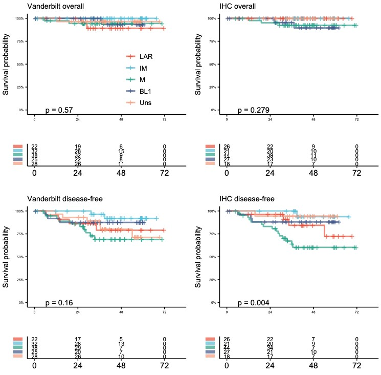
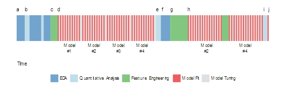
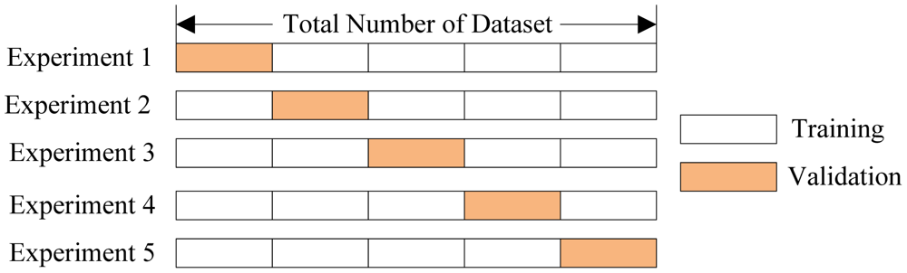

```{r setup, include=FALSE}
knitr::opts_chunk$set(
	echo = FALSE,
	message = FALSE,
	warning = FALSE
)
options(htmltools.dir.version = FALSE)
```

```{r xaringan-themer, include=FALSE, warning=FALSE}
library(xaringanthemer)
style_mono_accent(
  base_color = "#1c5253",
  header_font_google = google_font("Josefin Sans"),
  text_font_google   = google_font("Montserrat", "300", "300i"),
  code_font_google   = google_font("Fira Mono"),
  base_font_size = "20px",
  text_font_size = "1.6rem"
  )

```

```{r cache=FALSE, include=FALSE, load_refs, include=FALSE}
library(RefManageR)
BibOptions(check.entries = FALSE,
           bib.style = "numeric",
           cite.style = "numeric",
           style = "markdown",
           hyperlink = FALSE,
           dashed = FALSE)
myBib <- ReadBib("references.bib", check = FALSE)
```

# Contents

- Hypothesis test vs Prediction
- Predictive Model vs Predictive modeling
- Over fitting
  - Hyper-parameter tuning
  - Cross-validation
  - Training set vs validation set vs test set
  
---
# Hypothesis test

---
# Hypothesis test

- Inference
- Statistical power
- Compatibility of data for hypothesis
- Assumptions of statistical model

---
# Prediction


---
# Prediction

- Building a model
- Performance
- Over-fitting

---
# Modeling process



---
# Cross-validation



---
# Hyperparameter tuning

.pull-right[
- Hyperparameter tuning
- Performance assessment
- 10-fold cross-validation resampling
]

.pull-left[

]

---
# References

- Applied Predictive Modeling, 2013, Max Kuhn, Kjell Johnson, Springer
- Feature Engineering and Selection: A Practical Approach for Predictive Models, 2019, Max Kuhn, Kjell Johnson, Chapman and Hall/CRC
- Applied Machine Learning" at Rstudio::conf 2019 (January 15 & 16, Austin, Texas
- Kang J, Lee A, Lee YS (2020) Prediction of PIK3CA mutations from cancer gene expression data. PLoS ONE 15(11): e0241514. 