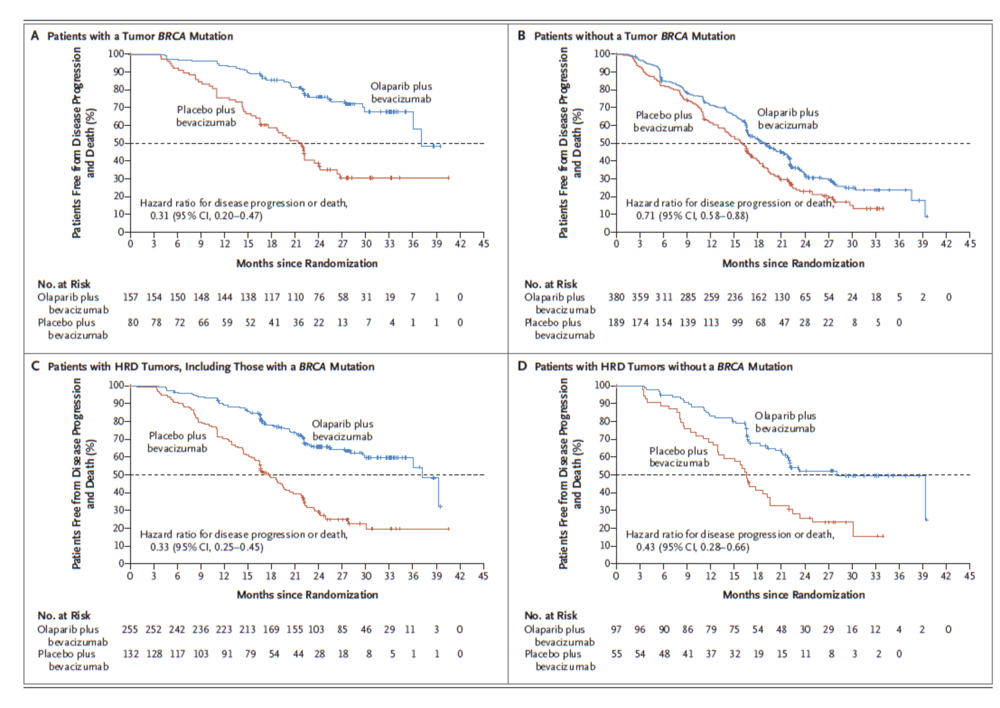

```{r setup, include=FALSE}
options(htmltools.dir.version = FALSE)
knitr::opts_chunk$set(
  fig.width=9, fig.height=3.5, fig.retina=3,
  out.width = "100%",
  cache = FALSE,
  echo = TRUE,
  message = FALSE, 
  warning = FALSE,
  hiline = TRUE
)
```

```{r xaringan-themer, include=FALSE, warning=FALSE}
library(xaringanthemer)
style_duo_accent(
  primary_color = "#1381B0",
  secondary_color = "#FF961C",
  inverse_header_color = "#FFFFFF"
)
```

```{r, load_refs, include=FALSE, cache=FALSE}
library(RefManageR)
library(citr)
BibOptions(check.entries = FALSE,
           bib.style = "numeric",
           cite.style = "numeric",
           hyperlink = FALSE,
           dashed = FALSE,
           first.inits = TRUE,
           no.print.fields = c("doi", "url", "isbn", "urldate"))
myBib <- ReadBib(here::here("static/slide/scarHRD/slides/scarHRD.bib"), check = FALSE)
```

# Myriad myChoice CDx

- Homologous recombination deficiency (HRD) status
- Presence mutations in BRCA1 and BRCA2 genes
- Sensitivity to platinum-based chemotherapy
- Ovarian cancer
- Treatment with Zejula (niraparib)

---
# Homologous recombination deficiency (HRD)
 - Double-strand break 
 - Genomic scars
    - Large-scale loss of heterogeneity `r Citep(myBib, "abkevichPatternsGenomicLoss2012")`
    - Telomere allelic imbalance `r Citep(myBib, "birkbakTelomericAllelicImbalance2012")`
    - Large-scale state transition `r Citep(myBib, "popovaPloidyLargeScaleGenomic2012")`

---
# Loss of Heterozygosity (HRD-LOH)


-  Number of 15 Mb exceeding LOH regions which do not cover the whole chromosome.

---

# Large Scale Transitions (LST)


- Chromosomal break between adjacent regions of at least 10 Mb, with a distance between them not larger than 3Mb
---

# Telomeric Allelic Imbalances


- Number AIs that extend to the telomeric end of a chromosome.

---
# HRD test as a companion diagnostics `r Citep(myBib, "ray-coquardOlaparibBevacizumabFirstLine2019")`


---
# Key concepts

- Allele-specific copy number
  - Allele frequency of **heterozygous single nucleotide polymorphism (heterozygous SNP)**
  
---
# HRD test programs

- Sequenza `r Citep(myBib, "faveroSequenzaAllelespecificCopy2015")`
- scarHRD `r Citep(myBib, "sztupinszkiMigratingSNPArraybased2018")`

---
class: left
class: my-one-page-font

## Allele-specific copy number analysis of tumors `r Citep(myBib, "attiyehGenomicCopyNumber2009")`

.pull-left[]
.pull-right[
- B allele frequency (BAF): relative quantity of the one allele compared to the other
- log R ratio (LRR): Total probe intensity of a given SNP relative to a canonical set of normal controls
- Loss of heterozygosity
- Allelic imbalances  


]

---
### Allele frequency`r Citep(myBib, "sunComputationalApproachDistinguish2018")`

$BAF$ $=$ ${pV+1-p} \over {pC+2(1-p)}$  

* Given copy number (C)
* Variant allele count (V)
* Sample purity (p)

---
### Three steps of Bayesian data analysis  
- Full probability model
- Conditioning on observed data (posterior distribution)
- Evaluating the fit of the model and the implications of the resulting posterior distribution

Bayesian Data Analysis 3rd, Andrew Gelman et. al.

---
class: my-one-page-font
### Full probability model

$$
\begin{aligned}
 r_i & \sim & N\left(log_2 \frac{pC_i+2(1-p)}{p \psi+2(1-p)}, \sigma_{ri} \right)
\end{aligned}
$$

$$
\begin{aligned}
 f_i & \sim & N\left(\frac{pM_i+(1-p)}{pC_i+2(1-p)}, \sigma_{fi} \right)
\end{aligned}
$$

$$\psi = \frac{\sum_{i}(l_iC_i) }{\sum_{i}(l_i)}$$

- $r_i$ (log R ratio): Median-normalized log-ratio coverage of all exons within $S_i$
- $f_i$ (B allele frequency): MAF of SNPs within segment $S_i$
- $p$: Tumor purity
- $S_i$: Genomic segment
- $l_i$: Length of $S_i
- $C_i$: Copy number of $S_i$
- $M_i$: Copy number of minor alleles in $S_i$, $0 \leq M_i \leq S_i$
- $\psi$: Tumor ploidy of the sample

---
### Sequenza results

```{r, echo=FALSE, out.width=500, out.height=500}
library(tidyverse)
segmentsResults <- read_delim(here::here("static/slide/scarHRD/TEST/test_segments.txt"), delim = '\t')
segmentsResults <- segmentsResults %>%
  mutate(across(where(is.numeric), ~ round(., digits = 1)))
DT::datatable(segmentsResults,
              options=list(autoWidth = FALSE,
                           pageLength = 5,
                           scrollX = TRUE), 
              height = "300", 
              width = "1000")
```

---
class: center
### Sequenza results
```{r, echo=FALSE, out.width=500, out.height=500}
magick::image_read_pdf(here::here("static/slide/scarHRD/TEST/Test_model_fit.pdf"), pages = 1, density = 500)
```

---
class: center
### Sequenza results
```{r, echo=FALSE, out.width=1000, out.height=500}
magick::image_read_pdf(here::here("static/slide/scarHRD/TEST/Test_genome_view.pdf"), pages = 1, density = 500)
```

---
class: center
### Sequenza results
```{r, echo=FALSE, out.width=500, out.height=500}
magick::image_read_pdf(here::here("static/slide/scarHRD/TEST/Test_CP_contours.pdf"), pages = 1, density = 500)
```

.footer[LPP: log-posterior probability]

---
### scarHRD
```{r}
library(scarHRD)
scar_score(here::here("static/slide/scarHRD/example/example1.txt"), reference = "grch38", chr.in.names = FALSE, seqz = FALSE)
```

---
class: my-one-page-font
# References

```{r refs, echo=FALSE, results="asis"}
PrintBibliography(myBib)
```

<style type="text/css">
.remark-slide-content {
    font-size: 32px;
    padding: 1em 4em 1em 4em;
}
.small-font {
  font-size: 28px;
}
.xsmall-font {
  font-size: 22px;
}
.my-one-page-font {
  font-size: 16px;
}
 {
    max-width: 100%;
}
</style>
